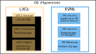

---
output:
  xaringan::moon_reader:
    seal: false
    css: [default,metropolis-fonts,custom.css,bootstrap.min.css]
    lib_dir: libs
    nature:
      highlightStyle: github
      highlightLines: true
      countIncrementalSlides: false
      ratio: '16:9'
      beforeInit: "./macros.js"
---


```{r setup, include=FALSE}
require(knitr)
require(kableExtra)
require(tidyverse)
options(kableExtra.latex.load_packages = FALSE)
options(knitr.table.format = "html")
options(htmltools.dir.version = FALSE)

library(knitr)  
library(reticulate)  
knitr::knit_engines$set(python = reticulate::eng_python)  

```


class: center, middle
background-image: url(imgs/LOGO-bigA-3101.jpg),url(imgs/cbi.png),url(imgs/logo_UT3_RVB.png)
background-position: 100% 0%,25% 100%,75% 100%
background-size: 28%,15%,20%

## .center[__Group Meeting bigA__]

### .center[__Virtualization manager__ to deploy services on __bigA__]

<hr />

.large[Vincent ROCHER | bigA | 17/08/2022]


---

## __Hypervisors__ to manage virtual machines


* OS Debian-based Linux distribution.
* Can run _LXC_ containers and full virtualization with _KVM_.
* No GUI. CLI and Web Interface for managing VMs.
* Hability to merge multiples ressources (computers) into clusters (not tested, didn't get it, kubernetes ?).
* Device/PCI passthrough (advanced).
* Offer ZFS storage solution.


* OS UNIX distribution : Core (FreeBSB) & Scale (Ubuntu).
* Can only run full virtualization with _KVM_ but work well with _dockers containers_ (Scale).
* No GUI. CLI and Web Interface for managing VMs.
* Device/PCI passthrough (seems more basic).
* Offer ZFS storage solution.

---

## _KVM_ and _LXC_

### Linux Containers (_LXC_)

* Can create and run multiple Linux operating systems (OS) simultaneously on a single Linux machine (LXC host).
* Use the host kernel.
* Availables OS depends of the host (so UNIX/LINUX).
* Very efficient : light, multiples containers for one host, runtime cost negligible.

### Kernel-Based Virtual Machine (_KVM_)

* Virtualize it's own Kernel.
* Can be any OS (Windows, mac ect ...)
* Heavy on ressources
* Less-Efficient

_KVM_ vs _LXC_ : _LXC_ cannot be displayed as a real OS (no GUI), _KVM_ can be remotely accessed (very Noice)

---

## _LXC_ vs _docker_

* Based on the host kernel
* _docker_ can be used on windows or macs, _LXC_ can't
* _Docker_ for hosting single applications, _LXC_ for hosting whole _OS_.
* _docker_ can use versioning, sharing between different host ... ect ...

#### So the idea is to use _LXC_ to create an isolated OS, and them run docker on it for each applications.

---

## One example of potential application

.center[
```{r out.width = '80%',echo=F}

```
]

---

## Usefull apps (web)

* Sharing files (nextcloud,Git-annex,ass).
* Git server (Gitea).
* Code deployment (Rundeck,Ansible,Jenkins).
* Documents storages (paperless-ngx, papermerge).
* Self-wiki (Tiddlywiki,Bookstack,Trilium) / code snippet (Trilium,snipbox,snippet-box) .
* Remote access via web browser (Apache Guacamole).
* Self-Hosted alternative to Trello (Planka).
* Self-Hosted alternative to Toggles (super-productivity,traggo,Kimai,...).
* [Awesome self-hosted applications](https://github.com/awesome-selfhosted/awesome-selfhosted).
